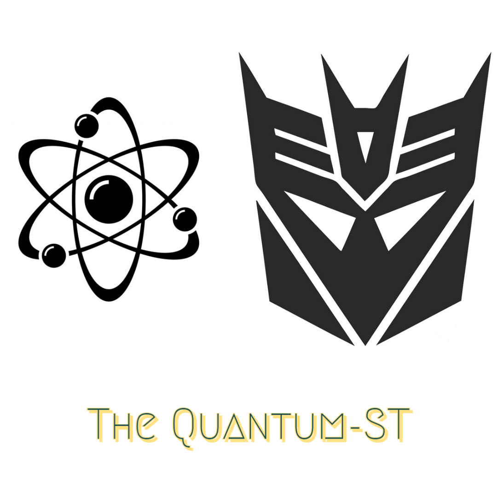

# QuantumSentenceTransformer
Quantum-Enhanced Transfer Learning for Natural Language Processing

This is based on the paper [1] https://arxiv.org/abs/1912.08278

The idea adopted here is to have a classical pre-trained model for capturing the Semantics of a text, freezing its initial layers and stacking at the end of the net a chosen number of Quantum Variational Circuits (QVC) that can be trained using PennyLane's interface. It can be shown from the universality of Fourier series that Quantum Neural Nets (given sufficiently wide and deep circuits) are universal function approximators! More on this can be found in [2].

What's intereting behind this idea? Well, the output of the classical net (that is, a real-valued vector) is the input to the QVC. So, this data is being mapped into the Hilbert Space! An interesting question that naturally arises is if besides the potential speedup Quantum Models may have, they can perhaps generalize better than classical ones, and if so, in which regime. This is an active area of research, and just to give a taste on this subject, in [3] it is shown that Quantum Nets have more expressivity than classical ones. First, a new measure of expressivity based on Effective Dimension is proposed, and then, it is shown that, for the same dataset, comparing a classical net with a quantum one (both with the same number of parameters), as the labels get corrupted, the quantum model gets more of its total capacity activated!

Another paper by Google shows that there is indeed a regime where the topology of the data mapped into the Hilbert space provides better learning generalization over the Real space [4].

References:

[1] Mari, Andrea, et al. "Transfer learning in hybrid classical-quantum neural networks." Quantum 4 (2020): 340.

[2] Schuld, Maria, and Francesco Petruccione. Supervised learning with quantum computers. Vol. 17. Berlin: Springer, 2018.

[3] Abbas, Amira, et al. "The power of quantum neural networks." Nature Computational Science 1.6 (2021): 403-409.

[4] Huang, Hsin-Yuan, et al. "Power of data in quantum machine learning." Nature communications 12.1 (2021): 1-9.
